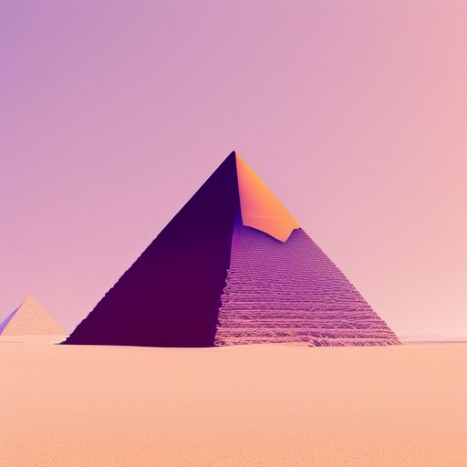

# Call of the Desert

<p align=center>
 
</p>

<br>

Transform your VSCode environment into a serene desert landscape with this color theme extension. Experience the beauty of the desert, whether in daylight or under the stars.

## Features

- **Two distinct themes**: Desert Day and Desert Night
- **Soothing color palettes** designed to reduce eye strain
- **Optimized syntax highlighting** for long coding sessions
- **Easy theme toggle** command for quick switching between day and night themes

## Installation

1. Open Visual Studio Code.
2. Navigate to the **Extensions** view by clicking on the Extensions icon in the Activity Bar on the side of the window or by pressing `Ctrl+Shift+X` (or `Cmd+Shift+X` on macOS).
3. In the search bar, type `Call of the Desert` and press Enter.
4. Locate the extension by **Anonknowsit** in the search results and click the **Install** button.

## Usage

### Selecting a Theme

1. Open the Command Palette (`Ctrl+Shift+P` or `Cmd+Shift+P` on macOS).
2. Type "Preferences: Color Theme" and press Enter.
3. Select either "Desert Day" or "Desert Night" from the list.

### Toggling Between Themes

Use the custom command to quickly switch between Desert Day and Desert Night:

1. Open the Command Palette (`Ctrl+Shift+P` or `Cmd+Shift+P` on macOS).
2. Type "Toggle Desert Theme" and press Enter.

## Customization

You can further customize the themes in your `settings.json` file. This allows you to override specific colors and settings to better suit your preferences.

### Steps to Customize

1. Open the Command Palette (`Ctrl+Shift+P` or `Cmd+Shift+P` on macOS).
2. Type "Preferences: Open Settings (JSON)" and press Enter.
3. Add your customizations under the `"workbench.colorCustomizations"` section.

### Example Customizations

#### Customizing Desert Day

To change the background color of the editor in the Desert Day theme:

```json
"workbench.colorCustomizations": {
    "[Desert Day]": {
        "editor.background": "#2B2B2B"
    }
}
```

#### Customizing Desert Night

To change the background color of the editor in the Desert Night theme:

```json
"workbench.colorCustomizations": {
    "[Desert Night]": {
        "editor.background": "#1A1A2E"
    }
}
```

### Customizing Other Elements

You can customize other UI elements as well. For example, to change the color of comments in both themes:

```json
"editor.tokenColorCustomizations": {
    "[Desert Day]": {
        "textMateRules": [
            {
                "scope": "comment",
                "settings": {
                    "foreground": "#00FF00"
                }
            }
        ]
    },
    "[Desert Night]": {
        "textMateRules": [
            {
                "scope": "comment",
                "settings": {
                    "foreground": "#00FF00"
                }
            }
        ]
    }
}
```

# Theme Details

### Desert Day

A warm and vibrant theme that captures the essence of a sun-drenched desert landscape. Perfect for daytime coding sessions.

### Desert Night

A cool and calming dark theme that evokes the tranquility of a desert night. Ideal for late-night coding or low-light environments.

### Contributing

If you'd like to contribute to the development of this extension, please visit my GitHub repository.

### Feedback and Issues

If you encounter any issues or have suggestions for improvements, please open an issue on our GitHub repository.

### About the Author

Created with ❤️ by [Anonknowsit](https://github.com/anonknowsit).
